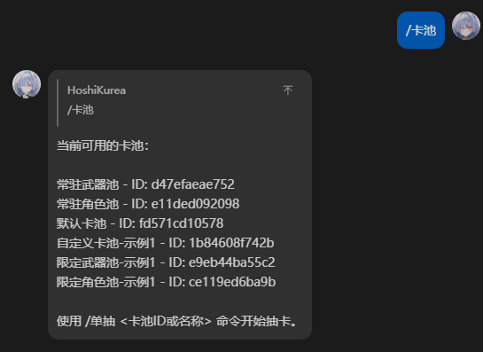
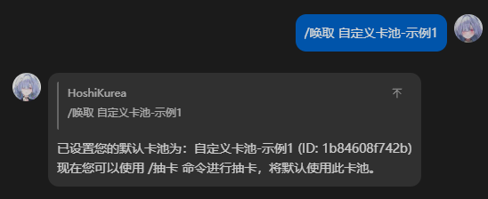
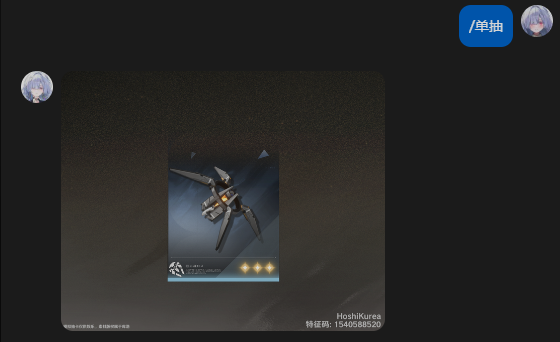
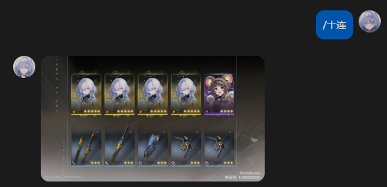
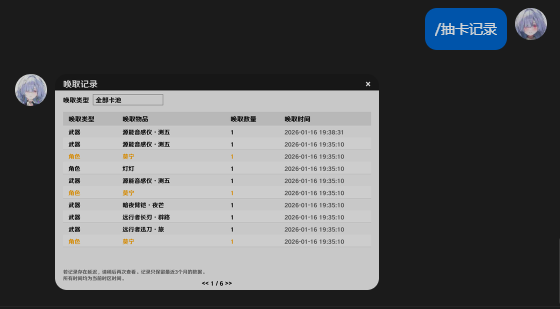
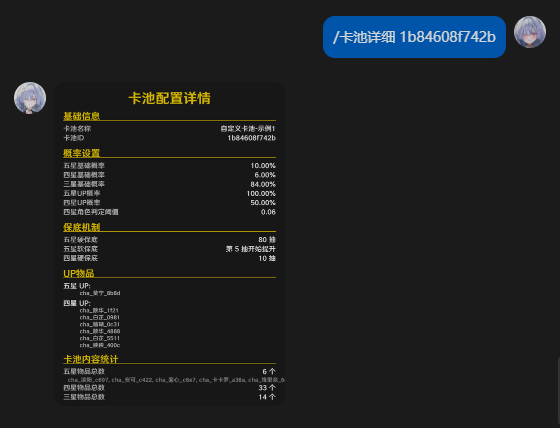
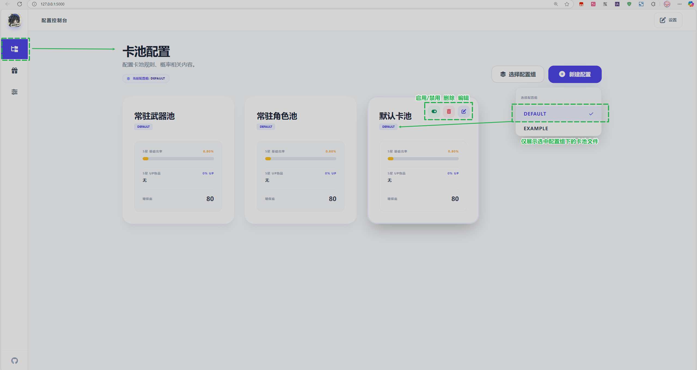
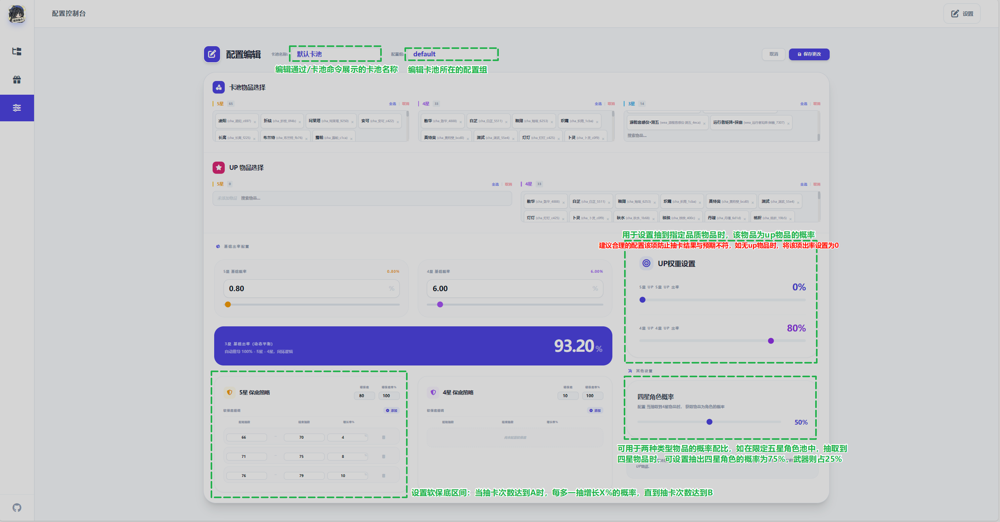
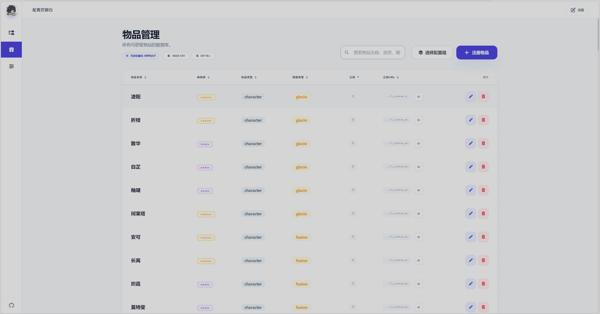

# 🔖WW_GACHA_SIM

## 功能特点

- ✅ 模拟单抽和十连抽
- ✅ 自定义卡池物品、概率配置
- ✅ 支持通过WEBUI可视化编写卡池配置文件
- ✅ 历史抽卡记录查询
- ✅ 抽卡状态持久化保存

## 安装插件

1. 自动安装
通过AstrBot仪表板安装插件，搜索`astrbot_plugin_ww_gacha_sim`

2. 手动安装
前往`AstrBot\data\plugins`目录执行以下命令或下载仓库主分支源代码后解压到该目录
```bash
git clone https://github.com/Ruafafa/astrbot_plugin_ww_gacha_sim.git ./data/plugins/astrbot_plugin_ww_gacha_sim
```
### 插件设置

通过AstrBot仪表板调整插件配置：

| 配置项 | 类型 | 默认值 | 说明 |
|--------|------|--------|------|
| `enable_rendering` | bool | `true` | 是否开启渲染功能，启用或禁用抽卡结果的图片渲染 |
| `save_rendered_results` | bool | `false` | 是否将渲染的抽卡结果图片保存到指定文件夹 |
| `config_storage_path` | string | `./card_pool_configs` | 卡池配置文件的存储目录路径 |
| `render_output_path` | string | `./rendered_results` | 抽卡结果图片的保存目录路径 |
| `cache_cleanup_interval` | int | `24` | 资源缓存自动清理的时间间隔（单位：小时），范围1-720 |
| `enable_history_recording` | bool | `true` | 是否保存用户的抽卡历史记录 |
| `proxy_url` | string | `""` | 网络代理地址|

## 功能列表

请使用 `/卡池` 获取所有可用卡池

### 基础指令
| 指令 | 别名 | 功能 |
|------|------|------|
| `/卡池` | `/卡池列表` `/查看卡池` | 查看所有可用卡池 |
| `/唤取 <卡池ID/名称>` | `/选抽` `/设置卡池` `/选择卡池` | 设置默认卡池 |
| `/单抽 <卡池ID/名称>` | `/单次抽卡` | 执行单次抽卡 |
| `/十抽 <卡池ID/名称>` | `/十连` `/10抽` `/10连` | 执行十连抽 |
| `/抽卡记录 <卡池ID/名称>` | `/历史记录` `/查看抽卡` `/抽卡历史` | 查看历史抽卡记录 |
| `/卡池详细 <卡池ID/名称>` | `/查看卡池详细` `/卡池详情` | 查看指定卡池的详细配置 |

### 指令演示

`/卡池`



`/唤取 <卡池ID/名称>`



`/单抽`



`/十抽`



`/抽卡记录 <卡池ID/名称>`



`/卡池详细 <卡池ID/名称>`



## 卡池配置

### WEBUI启动

Astrbot运行过程中，在插件根目录(AstrBot\data\plugins\astrbot_plugin_ww_gacha_sim)下执行以下命令启动WEBUI
```bash
python -m src.web.server 
```
WEBUI默认端口为`5000`，首次启动插件时会自动打开浏览器访问`http://localhost:5000`，如遇到端口冲突可以在启动时指定不同端口，例如：
```bash
python -m src.web.server --port 8000
```
> [!WARNING]
> 注意！卡池的状态只会在插件加载时生效，更改卡池配置文件后请重载插件以确保配置生效！！！

### 卡池配置界面
WEBUI的卡池配置页默认展示 default 配置组下的所有卡池配置，你可以通过左上角的选择配置组来切换不同的配置组，如果你想添加新的配置组，只需要在新建的卡池配置中指定新的配置组名称即可自动创建配置组。
你可以在该界面增添、删除、启用、禁用不同的卡池配置，也可以直接编辑JSON文件来修改卡池配置（不建议这样操作）。
卡池配置文件默认位于 `card_pool_configs/` 目录下，支持JSON格式

> [!NOTE]
> 虽然WEBUI中只展示了选中配置组下的卡池配置，但这不意味者其他的配置组下的卡池配置不会被用户的`/卡池`指令展示，**只有通过启用、禁用卡池配置，才会在`/卡池`指令中选择展示。**
> 同时，**卡池的状态只会在插件加载时生效**，如果在插件运行过程中修改了卡池的状态（比如启用状态或者概率参数），必须重载插件后才可应用最新状态。

### 卡池内容编辑
点击指定卡池的编辑按钮，即可进入编辑页面，这里涉及到的物品，即为卡池中的获取物，如角色、武器。编辑界面的卡池配置说明如下图所示：


### 卡池物品管理
在编辑页面，你可以添加、删除、修改卡池中的物品。

每个物品都有以下属性：

- `external_id`：物品的唯一标识符，用于在卡池配置中引用物品。
- `name （名称）`：物品的名称，用于显示在抽卡结果中。
- `type （类型）`：物品的类型，如角色、武器等。
- `rarity（稀有度）`：物品的稀有度，如五星、四星等。
- `affiliated_type（附属类型）`：物品的关联类型，如冰、冷凝。
- `portrait Path（立绘）`：物品的渲染时所用立绘的本地资源路径
- `portrait URL（立绘URL）`：物品的渲染时所用立绘的URL


> [!NOTE]
> 物品的 `external_id` 必须是唯一的，不能与其他物品重复。

需要注意的是，各个配置组下的物品列表是相互隔离的，即一个配置组下的物品不会影响到其他配置组下的物品。
在首次使用或创建配置组时，如果该配置组中没有物品，插件会自动从 `default.csv` 导入默认物品数据。

> [!WARNING]
> 由于默认的default.csv文件中没有提供立绘的本地路径，在开启了渲染功能后，物品的立绘将从URL中获取。而默认提供的URL是从 GITHUB 上的仓库 `TomyJan/WutheringWaves-UIResources` 中获取的，国内**建议开启系统代理**，否则可能会因为网络问题导致加载失败。 
> 如果无法开启系统代理，也可以手动下载物品立绘并指定本地路径。并直接修改物品的立绘URL为本地路径。
> 你也可以通过一些加速服务如 [gh-proxy.com](https://gh-proxy.com/)，在`.csv`文件中替换原有的URL为加速后的URL，通过WEBUI提供的导入csv功能一键导入。
> 请确保所有物品的立绘URL都能正常访问，否则渲染功能可能会失败。
  
