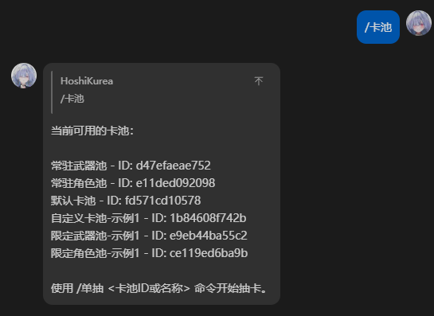
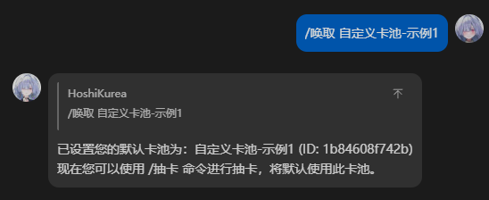
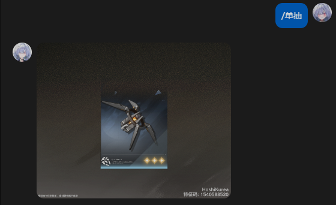
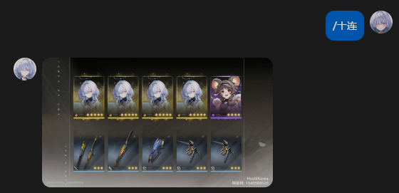
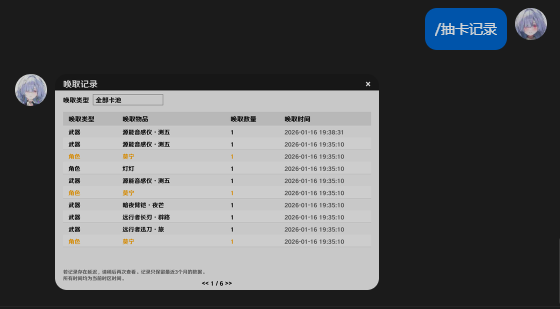
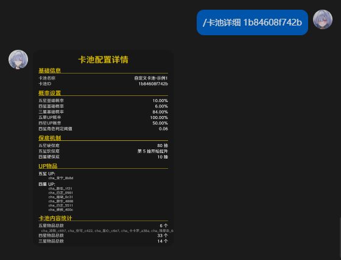
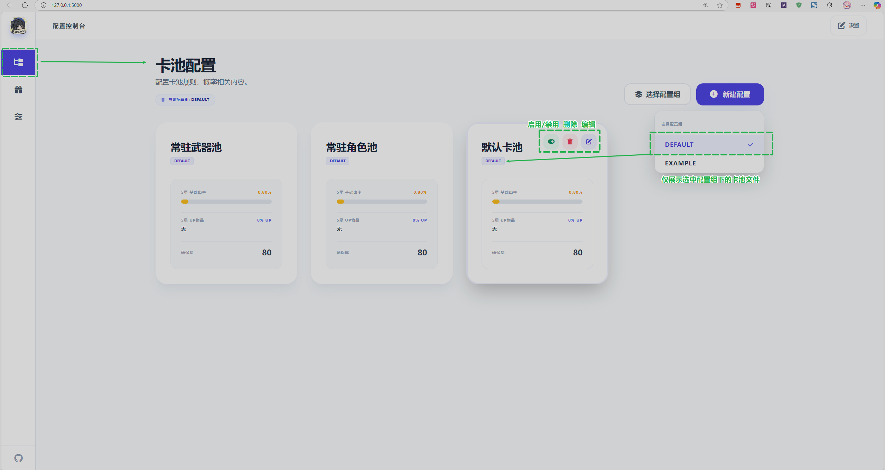
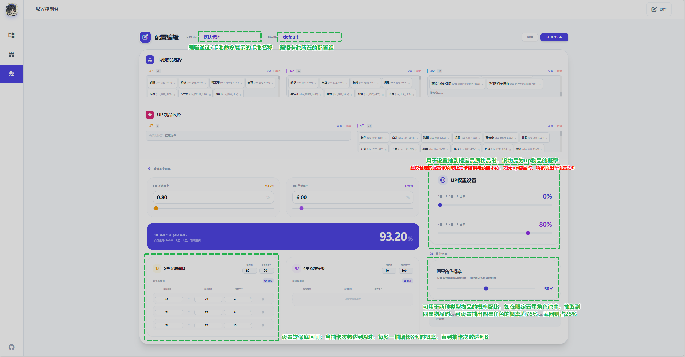
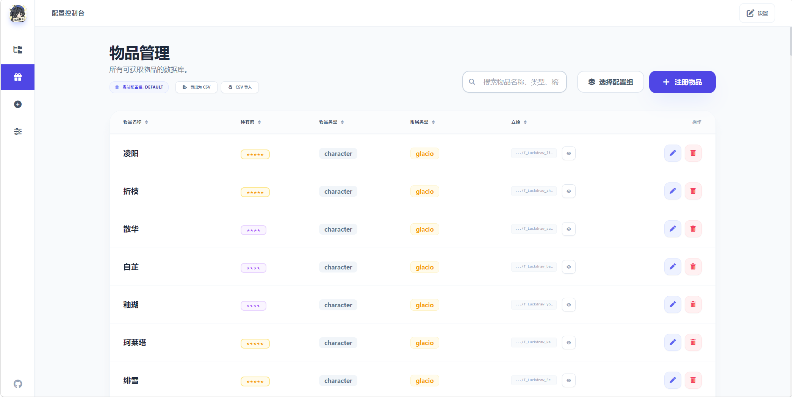
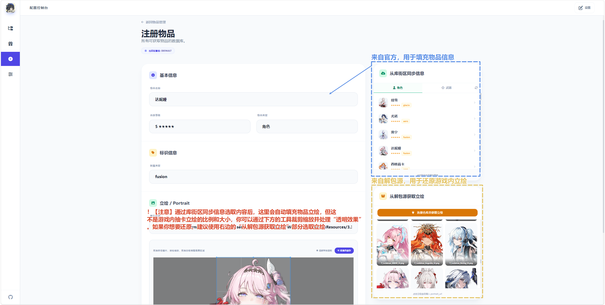

<div align="center">

# 🎰 AstrBot 鸣潮抽卡模拟插件

**一个基于 AstrBot 的鸣潮模拟抽卡插件，支持自定义卡池概率、图像渲染、WebUI 可视化管理。**

<p>
  <a href="https://github.com/Ruafafa/astrbot_plugin_ww_gacha_sim/releases"></a>
  <a href="#"></a>
  <a href="#"></a>
  <a href="./LICENSE"></a>
</p>

<p>
  
  
  
  
</p>

</div>

---

## 📖 目录 (Table of Contents)

- [✨ 核心特性](#✨-核心特性)
- [🚀 安装插件](#🚀-安装插件)
- [⚙️ 插件配置项](#⚙️-插件配置项)
- [📨 基础指令](#📨-基础指令)
- [📸 指令演示](#📸-指令演示)
- [🕸️ WEBUI](#🕸️-webui)
  - [🔄 自动启动](#🔄-自动启动)
  - [🗂️ 卡池配置界面](#🗂️-卡池配置界面)
  - [✏️ 卡池内容编辑](#✏️-卡池内容编辑)
  - [📦 卡池物品管理](#📦-卡池物品管理)
  - [📝 卡池物品注册](#📝-卡池物品注册)
- [⭐ 感谢](#⭐-感谢)

---

> [!WARNING]
> （推荐）从 `1.0.x` 升级到 `1.1.0` 版本时，建议**优先通过** AstrBot 仪表盘卸载插件并勾选「**同时删除插件持久化数据**」，重新安装到最新版。**若已经升级**，可手动删除原先版本的插件持久化数据（位于 `data\plugin_data\astrbot_plugin_ww_gacha_sim`）后重载插件，以免升级后出现意想不到的报错。

---

## ✨ 核心特性

<table>
<tr>
<td width="50%" valign="top">

### 🎲 模拟抽卡
- **单抽 & 十连**：支持单抽和十连两种抽卡模式。
- **自定义概率**：可自由配置各稀有度的抽取概率。
- **保底机制**：内置软保底 + 硬保底机制，真实还原抽卡体验。

</td>
<td width="50%" valign="top">

### 🎨 图像渲染
- **精美图片**：将抽卡结果渲染为精美图片，支持单抽、十连、历史记录、卡池详情等多种场景。
- **立绘展示**：自动获取并展示角色/武器立绘。

</td>
</tr>
<tr>
<td width="50%" valign="top">

### 🕸️ WEBUI 可视化
- **卡池配置管理**：通过 WebUI 可视化创建、编辑、启用/禁用卡池配置。
- **物品注册**：支持手动填写表单、Wiki 数据同步、解包源直连等多种方式注册抽卡物品。
- **裁剪工具**：内置立绘裁剪与渐变处理，适配抽卡界面比例。

</td>
<td width="50%" valign="top">

### 📊 多配置组
- **多卡池管理**：支持同时管理多个卡池配置，随时切换。
- **配置组隔离**：不同配置组下的物品数据相互隔离，适合多服或多人场景。
- **持久化状态**：保底计数、UP 状态跨会话保留。

</td>
</tr>
</table>

---

## 🚀 安装插件

### 🖥️ 自动安装

通过 AstrBot 仪表板安装插件，搜索 `astrbot_plugin_ww_gacha_sim`。

### 🛠️ 手动安装

前往 `AstrBot\data\plugins` 目录执行以下命令：

```bash
git clone https://github.com/Ruafafa/astrbot_plugin_ww_gacha_sim.git ./data/plugins/astrbot_plugin_ww_gacha_sim
```

或下载仓库主分支源代码后解压到该目录。

---

## ⚙️ 插件配置项

通过 AstrBot 仪表板（或直接编辑 `data/cmd_config.json`）调整插件配置：

| 配置项 | 类型 | 默认值 | 说明 |
|--------|------|--------|------|
| `enable_rendering` | bool | `true` | 是否开启渲染功能，启用或禁用抽卡结果的图片渲染 |
| `enable_history_recording` | bool | `true` | 是否保存用户的抽卡历史记录 |
| `enable_webui` | bool | `true` | 是否在插件加载时自动启动 WebUI 管理界面 |
| `webui_port` | int | `5000` | WebUI 的运行端口号，范围 1024-65535 |
| `save_rendered_results` | bool | `false` | 是否将渲染的抽卡结果图片保存到 data 目录下 |
| `cache_cleanup_interval` | int | `24` | 资源缓存自动清理的时间间隔（单位：小时），范围 1-720 |
| `enable_proxy` | bool | `false` | 是否启用网络代理，开启后需配置有效的代理地址 |
| `proxy_url` | string | `""` | 网络代理地址，例如 `http://127.0.0.1:7890` |

---

## 📮 基础指令

| 指令 | 别名 | 功能 |
|------|------|------|
| `/卡池` | `/卡池列表` `/查看卡池` | 查看所有可用卡池 |
| `/唤取 <卡池ID/名称>` | `/选抽` `/设置卡池` `/选择卡池` | 设置用户的默认卡池 |
| `/单抽 <卡池ID/名称>` | `/单次抽卡` `/抽卡` `/单次唤取` | 执行单次抽卡 |
| `/十抽 <卡池ID/名称>` | `/十连` `/10抽` `/10连` | 执行十连抽 |
| `/唤取记录 <卡池ID/页号>` | `/抽卡记录` `/查看抽卡` `/抽卡历史` | 查看历史抽卡记录（支持分页） |
| `/卡池详细 <卡池ID/名称>` | — | 查看指定卡池的详细配置 |
| `/重载卡池` | `/刷新卡池` | 重新加载所有卡池配置文件 |
| `/抽卡帮助` | `/鸣潮帮助` `/wgs_help` | 显示本插件所有可用命令 |

---

## 📸 指令演示

> 以下图片均通过插件的渲染功能自动生成。

`/卡池` — 查看所有可用卡池



`/唤取 <卡池ID/名称>` — 设置用户的默认卡池



`/单抽` — 执行单次抽卡



`/十抽` — 执行十连抽



`/抽卡记录 <卡池ID/名称>` — 查看历史抽卡记录



`/卡池详细 <卡池ID/名称>` — 查看指定卡池的详细配置



---

## 🕸️ WEBUI

### 🔄 自动启动

插件加载时将根据配置项自动启动 WebUI。在 AstrBot 仪表板中设置以下配置：

- `enable_webui`（默认 `true`）：插件加载时自动在后台启动 WebUI
- `webui_port`（默认 `5000`）：指定 WebUI 的运行端口

### 🗂️ 卡池配置界面

WEBUI 的卡池配置页默认展示 `default` 配置组下的所有卡池配置，你可以通过左上角的选择配置组来切换不同的配置组。如果你想添加新的配置组，只需要在新建的卡池配置中指定新的配置组名称即可自动创建。

你可以在该界面增添、删除、启用、禁用不同的卡池配置，也可以直接编辑 JSON 文件来修改卡池配置（不建议这样操作）。

卡池配置文件默认位于 `card_pool_configs/` 目录下，支持 JSON 格式。



> [!NOTE]
> 虽然 WEBUI 中只展示了选中配置组下的卡池配置，但这不意味着其他配置组下的卡池配置不会被用户的 `/卡池` 指令展示，**只有通过启用、禁用卡池配置，才会在 `/卡池` 指令中选择展示。**
>
> 同时，**卡池的状态只会在插件加载时生效**，如果在插件运行过程中修改了卡池的状态（比如启用状态或者概率参数），必须重载插件后才可应用最新状态。

### ✏️ 卡池内容编辑

点击指定卡池的编辑按钮，即可进入编辑页面。这里涉及到的物品，即为卡池中的获取物，如角色、武器。编辑界面的卡池配置说明如下图所示：



### 📦 卡池物品管理

在编辑页面，你可以添加、删除、修改卡池中的物品。



每个物品都有以下属性：

| 属性 | 说明 |
|------|------|
| `external_id` | 物品的唯一标识符，用于在卡池配置中引用物品 |
| `name`（名称） | 物品的名称，用于显示在抽卡结果中 |
| `type`（类型） | 物品的类型，如角色、武器等 |
| `rarity`（稀有度） | 物品的稀有度，如五星、四星等 |
| `affiliated_type`（附属类型） | 物品的关联类型，如属性（气动、冷凝）或武器类型（迅刀） |
| `portrait_url`（立绘 URL） | 物品渲染时所用立绘的图片地址 |

### 📝 卡池物品注册

在左侧导航栏点击「物品注册」即可进入物品注册页面。该页面提供多种物品来源途径，你可以组合使用进行注册：



#### 📋 手动填写表单

页面左侧为主表单，支持填写以下字段：

| 字段 | 说明 |
|------|------|
| 物品名称 | 物品的显示名称 |
| 品质等级 | 五星 / 四星 / 三星 |
| 类型 | 角色 / 武器 |
| 附属类型 | 关联的属性或武器类型（如气动、迅刀） |
| 立绘 URL | 物品立绘图片的直链地址 |

立绘图片支持裁剪处理。填入 URL 后，图片预览区提供以下操作：

- **拖拽移动、滚轮缩放** — 调整裁剪框位置和大小
- **底部渐变透明** — 勾选后可在裁剪时为图片底部添加渐变透明效果
- **处理并保存** — 将裁剪后的图片（404×560px，PNG 格式）上传保存至本地

> [!NOTE]
> 必须完成「处理并保存」步骤后，才能提交注册表单，否则按钮不可点击。

#### 🌐 从库街区 Wiki 同步

页面右侧面板可从库街区（Kurobbs）Wiki 自动拉取角色和武器数据：

1. 点击右上角刷新按钮（⟳）获取最新物品列表
2. 切换「角色」/「武器」标签页浏览
3. 点击任意物品，自动将名称、稀有度、类型、附属类型及立绘 URL 填入左侧表单

该功能通过调用 Kurobbs Wiki API（`catalogue 1105` 角色、`catalogue 1106` 武器）获取条目详情，并解析元素属性与武器类型字段。

#### 📦 从解包源获取立绘

右侧另一个面板可从默认解包源仓库直接获取游戏抽卡立绘：

1. 点击「连接仓库并获取立绘」按钮加载立绘列表
2. 面板内以缩略图网格展示所有可用立绘
3. 点击任意立绘，自动将对应的图片 URL 填入表单的「立绘 URL」字段

默认解包源为 [TomyJan/WutheringWaves-UIResources](https://github.com/TomyJan/WutheringWaves-UIResources) 仓库中的抽卡立绘目录（`T_Luckdraw*_UI.png`），通过 GitHub 代理（gh-proxy.com）加速加载。

立绘获取后配合裁剪工具处理即可用于注册。

#### ✅ 注册提交

确认左侧表单信息填写完整后，点击「完成注册」提交。注册成功后表单将自动重置，可继续注册下一个物品。

> [!NOTE]
> 各个配置组下的物品列表是相互隔离的，即一个配置组下的物品不会影响到其他配置组下的物品。
>
> 在首次使用或创建配置组时，如果该配置组中没有物品，插件会自动从 `default.csv` 导入默认物品数据。

> [!WARNING]
> 插件立绘的获取来自于默认解包源：`https://github.com/TomyJan/WutheringWaves-UIResources`。为确保渲染结果图正常显示，建议国内用户开启系统代理，或将**立绘获取路径替换为本地路径**，或**采用 GitHub 代理加速服务**（如 gh-proxy）。

---

<div align="center">

## ⭐ 感谢

### 🌟 如果这个项目对您有帮助，请考虑给一个 Star ⭐

<a href="https://github.com/Ruafafa/astrbot_plugin_ww_gacha_sim">
  
</a>

<br>

<a href="https://github.com/Ruafafa/astrbot_plugin_ww_gacha_sim/issues"></a>
&nbsp;
<a href="https://github.com/Ruafafa/astrbot_plugin_ww_gacha_sim/pulls"></a>
&nbsp;
<a href="https://github.com/Ruafafa/astrbot_plugin_ww_gacha_sim/discussions"></a>

<br><br>

<sub>最后更新：2026-05-03</sub>

</div>
