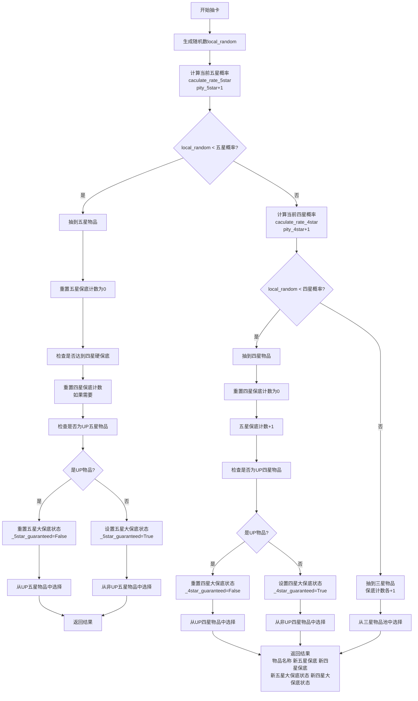

```mermaid
flowchart TD
    A[开始抽卡] --> B[生成随机数local_random]
    B --> C[计算当前五星概率<br/>caculate_rate_5star<br/>pity_5star+1]
    C --> D{local_random < 五星概率?}
    
    D -->|是| E[抽到五星物品]
    D -->|否| F[计算当前四星概率<br/>caculate_rate_4star<br/>pity_4star+1]
    
    E --> G[重置五星保底计数为0]
    G --> H[检查是否达到四星硬保底]
    H --> I[重置四星保底计数<br/>如果需要]
    I --> J[检查是否为UP五星物品]
    J --> K{是UP物品?}
    K -->|是| L[重置五星大保底状态<br/>_5star_guaranteed=False]
    K -->|否| M[设置五星大保底状态<br/>_5star_guaranteed=True]
    L --> N[从UP五星物品中选择]
    M --> O[从非UP五星物品中选择]
    N --> P[返回结果]
    O --> P
    
    F --> Q{local_random < 四星概率?}
    Q -->|是| R[抽到四星物品]
    Q -->|否| S[抽到三星物品<br/>保底计数各+1]
    
    R --> T[重置四星保底计数为0]
    T --> U[五星保底计数+1]
    U --> V[检查是否为UP四星物品]
    V --> W{是UP物品?}
    W -->|是| X[重置四星大保底状态<br/>_4star_guaranteed=False]
    W -->|否| Y[设置四星大保底状态<br/>_4star_guaranteed=True]
    X --> Z[从UP四星物品中选择]
    Y --> AA[从非UP四星物品中选择]
    Z --> AB[返回结果]
    AA --> AB
    
    S --> AC[从三星物品池中选择]
    AC --> AB
    
    AB[返回结果<br/>物品名称 新五星保底 新四星保底<br/>新五星大保底状态 新四星大保底状态]
```